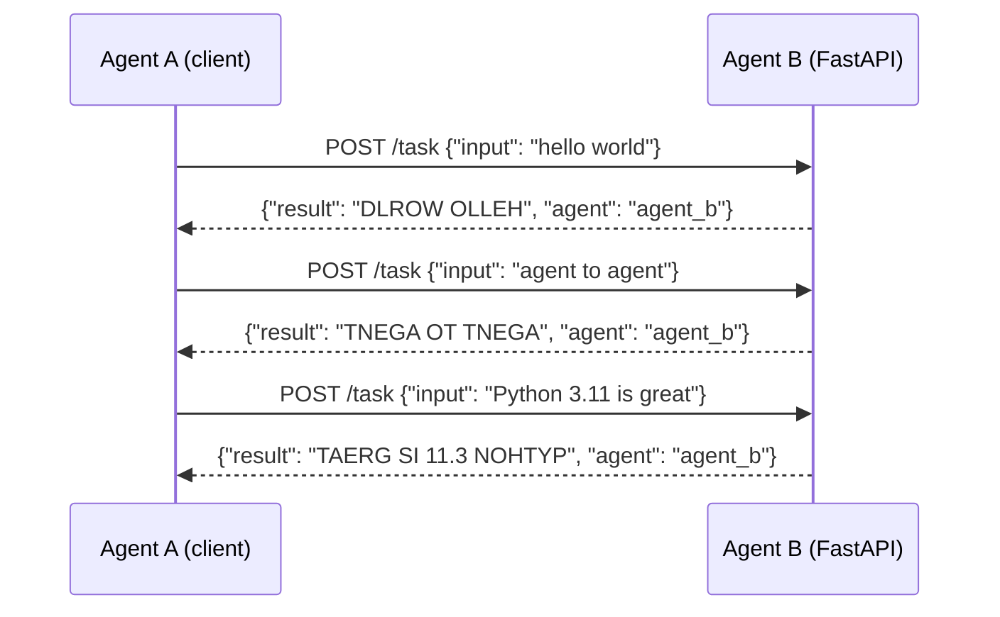

# Pattern 1: Direct Request-Response

## Overview

The simplest agent communication pattern: **Agent A calls Agent B directly over HTTP** and waits synchronously for the response. There is no intermediary, no queue, and no indirection.

Agent B is a FastAPI service that reverses and uppercases the input string (e.g. `"hello"` → `"OLLEH"`). Agent A is a script that sends three requests and prints each result.

## When to Use / Trade-offs

| Aspect | Detail |
|---|---|
| **Use when** | Low latency is required; the caller needs the result before it can continue; the topology is simple (1-to-1). |
| **Avoid when** | Agent B might be slow or unavailable; you need to fan out to many agents; you want to decouple deployments. |
| **Tight coupling** | Agent A must know Agent B's URL and API schema at call time. |
| **Easy to trace** | Every call has a clear initiator and a synchronous response — trivial to debug with logs or a tracer. |
| **Failure mode** | If Agent B is down, Agent A fails immediately. No buffering, no retry logic built-in. |

## Architecture



## Prerequisites

- Python 3.11+
- Install dependencies:

```bash
cd 01-direct-request-response
pip install -r requirements.txt
```

## How to Run

**Terminal 1 — start Agent B:**

```bash
cd 01-direct-request-response
python agent_b.py
# Agent B listens on http://localhost:8001
```

**Terminal 2 — run Agent A:**

```bash
cd 01-direct-request-response
python agent_a.py
```

Expected output:

```
=== Agent A: Direct Request-Response Demo ===

[Request 1] input='hello world'
[Response 1] result='DLROW OLLEH'  agent='agent_b'

[Request 2] input='agent to agent communication'
[Response 2] result='NOITACINUMMOC TNEGA OT TNEGA'  agent='agent_b'

[Request 3] input='Python 3.11 is great'
[Response 3] result='TAERG SI 11.3 NOHTYP'  agent='agent_b'

=== Done ===
```

## How to Run Tests

Tests use FastAPI's `TestClient` — no running server needed:

```bash
cd 01-direct-request-response
pytest test_integration.py -v
```
