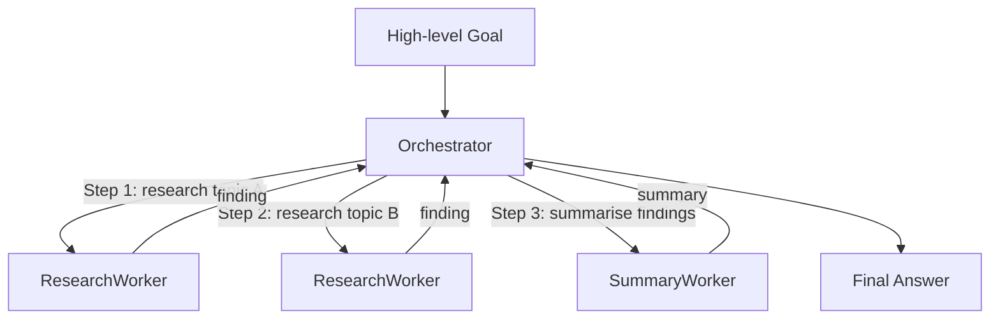

# Pattern 2: Hierarchical Delegation

## Overview

A single **Orchestrator** receives a high-level goal, decomposes it into ordered subtasks, and delegates each subtask to a specialist worker. Workers operate independently and are unaware of each other. The Orchestrator collects all partial results and assembles the final answer.

This pattern is common in multi-agent pipelines where a "manager" agent breaks down complexity and a set of "specialist" agents handle focused concerns.

## When to Use / Trade-offs

| Aspect | Detail |
|---|---|
| **Use when** | A goal can be cleanly decomposed; specialists benefit from isolation; you want a single coordinator tracking progress. |
| **Avoid when** | Workers need to communicate with each other; the decomposition is dynamic and hard to express up-front. |
| **Single point of failure** | If the Orchestrator crashes, the entire pipeline stops — even if workers are healthy. |
| **No worker-failure handling** | This implementation has no try/except around worker calls — an unhandled exception in any worker propagates and aborts the entire pipeline. Production implementations should catch worker errors, log them, and decide whether to retry, skip, or fail-fast. |
| **Sequential delegation** | Workers are called one at a time in this implementation. Parallel delegation (spawning all research workers concurrently) is a common optimisation but adds coordination complexity and context-fragmentation risk. |
| **Easy to extend** | Add new worker types without changing existing ones; only the Orchestrator's decomposition logic changes. |
| **Observability** | All delegation is visible through the Orchestrator's logs — straightforward to audit. |

## Architecture



## Prerequisites

- Python 3.11+
- No external services required

```bash
cd 02-hierarchical-delegation
pip install -r requirements.txt
```

## How to Run

```bash
cd 02-hierarchical-delegation
python orchestrator.py
```

Expected output (abbreviated):

```
============================================================
  Orchestrator received goal: 'distributed systems fault tolerance and consensus algorithms'
============================================================

[Step 1] Delegating to ResearchWorker -> topic='distributed systems fault tolerance'
[Step 1] ResearchWorker returned: Finding on '...': ...

[Step 2] Delegating to ResearchWorker -> topic='consensus algorithms'
[Step 2] ResearchWorker returned: Finding on '...': ...

[Step 3] Delegating to SummaryWorker -> 2 findings
[Step 3] SummaryWorker returned: EXECUTIVE SUMMARY (2 sources analysed): ...

============================================================
  Final answer assembled by Orchestrator
============================================================
```

## How to Run Tests

```bash
cd 02-hierarchical-delegation
pytest test_integration.py -v
```
