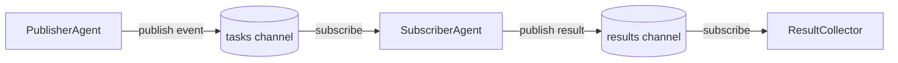
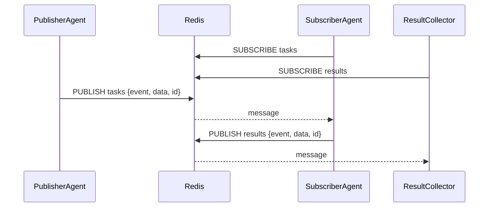

# Pattern 3: Publish-Subscribe

## Overview

Agents communicate through **named channels** brokered by Redis pub/sub. No agent holds a reference to another — they only know channel names and message schemas.

- **PublisherAgent** pushes task events to the `tasks` channel.
- **SubscriberAgent** reads from `tasks`, processes each task (appends `[processed]`), and publishes results to the `results` channel.
- **ResultCollector** reads from `results` and accumulates the final output.

## When to Use / Trade-offs

| Aspect | Detail |
|---|---|
| **Use when** | You want loose coupling; multiple consumers might process the same event; producers should not wait for consumers. |
| **Avoid when** | You need guaranteed delivery (Redis pub/sub drops messages if no subscriber is connected); strict ordering is required. |
| **Loose coupling** | Agents can be added, removed, or replaced without touching each other's code. |
| **Ordering** | Redis pub/sub delivers messages in order *within a channel* but gives no cross-channel ordering guarantees. |
| **Debugging** | Harder to trace than direct calls — you need to correlate events by ID across multiple channels. |
| **No persistence** | Messages published when no subscriber is connected are lost. Use Redis Streams for durability. |
| **Dedicated connection** | `pubsub()` creates its own connection; the original `Redis` client remains usable for `publish()` and other commands. This is why `SubscriberAgent` can both subscribe and publish using the same client instance. |
| **Auto-reconnect** | redis-py's `PubSub` automatically reconnects and re-subscribes to channels after a dropped connection. However, any messages published during the disconnection window are permanently lost — auto-reconnect restores the subscription, not the missed messages. |
| **Subscription confirmation** | `pubsub.listen()` first yields a `{"type": "subscribe", ...}` confirmation message before delivering real messages. The implementation filters this by checking `raw["type"] != "message"`, which is the correct pattern. |

## Architecture





## Prerequisites

- Python 3.11+
- Redis running on `localhost:6379`

```bash
# Start Redis via docker-compose (from repo root)
docker-compose up redis

# Install dependencies
cd 03-publish-subscribe
pip install -r requirements.txt
```

## How to Run

```bash
cd 03-publish-subscribe
python run_demo.py
```

Expected output:

```
=== Publish-Subscribe Demo ===
Tasks to publish: 5

--- Publishing 5 tasks ---

[PublisherAgent] Published task 'a1b2c3d4': 'analyse market trends'
[SubscriberAgent] Processing task 'a1b2c3d4': 'analyse market trends'
[SubscriberAgent] Published result for 'a1b2c3d4'
[ResultCollector] Collected result 'a1b2c3d4': 'analyse market trends [processed]'
...

==================================================
  Summary: 5/5 results collected
==================================================
```

## How to Run Tests

Tests use `fakeredis` — no Redis server needed:

```bash
cd 03-publish-subscribe
pytest test_integration.py -v
```
