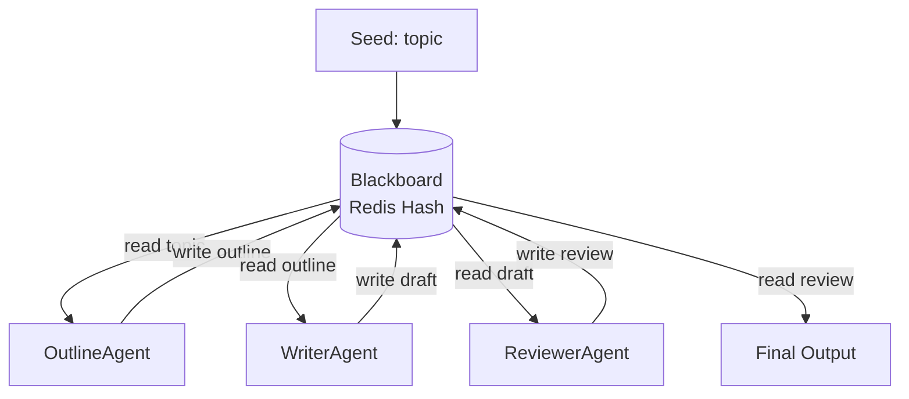

# Pattern 4: Blackboard

## Overview

A **Blackboard** is a shared workspace (backed by a Redis Hash) where specialist agents read partial results left by previous agents and write their own contributions. No agent calls another directly — all coordination flows through the shared state.

In this implementation, three agents collaborate to produce a written document:

| Agent | Reads | Writes |
|---|---|---|
| `OutlineAgent` | `"topic"` | `"outline"` (JSON list of section names) |
| `WriterAgent` | `"outline"` | `"draft"` (full document text) |
| `ReviewerAgent` | `"draft"` | `"review"` (approval or issues) |

## When to Use / Trade-offs

| Aspect | Detail |
|---|---|
| **Use when** | Multiple independent agents contribute to a shared artifact; order is partially flexible; late-binding between producers and consumers is desirable. |
| **Avoid when** | Agents need real-time communication; you need strict ordering guarantees; the workspace grows unbounded without a GC strategy. |
| **Shared state risks** | Concurrent writes to the same key cause last-writer-wins races. Use Redis transactions (`WATCH`/`MULTI`/`EXEC`) or optimistic locking if agents run in parallel. |
| **Termination** | Requires an explicit stopping condition — e.g. a `"review"` key reaching status `"done"`. Without it, agents may loop indefinitely waiting for input. |
| **Observability** | The full history of the task lives in the blackboard — easy to inspect at any point. |

## Architecture



## Prerequisites

- Python 3.11+
- Redis running on `localhost:6379`

```bash
# Start Redis via docker-compose (from repo root)
docker-compose up redis

# Install dependencies
cd 04-blackboard
pip install -r requirements.txt
```

## How to Run

```bash
cd 04-blackboard
python run_demo.py
```

Expected output (abbreviated):

```
=== Blackboard Pattern Demo ===
Topic: 'distributed consensus algorithms in fault-tolerant systems'

--- Blackboard state after: seeding topic ---
  'topic' [seeded]: 'distributed consensus algorithms...'

[OutlineAgent] Reading topic: 'distributed consensus algorithms...'
[OutlineAgent] Wrote 7-section outline to blackboard.

--- Blackboard state after: OutlineAgent ---
  'topic' [seeded]: ...
  'outline' [done]: '["Introduction to distributed consensus..."...]'

[WriterAgent] Reading outline (7 sections).
...
[ReviewerAgent] Review: APPROVED

============================================================
  Final Review:
============================================================
STATUS: APPROVED
Sections reviewed: 7
...
```

## How to Run Tests

Tests use `fakeredis` — no Redis server needed:

```bash
cd 04-blackboard
pytest test_integration.py -v
```
