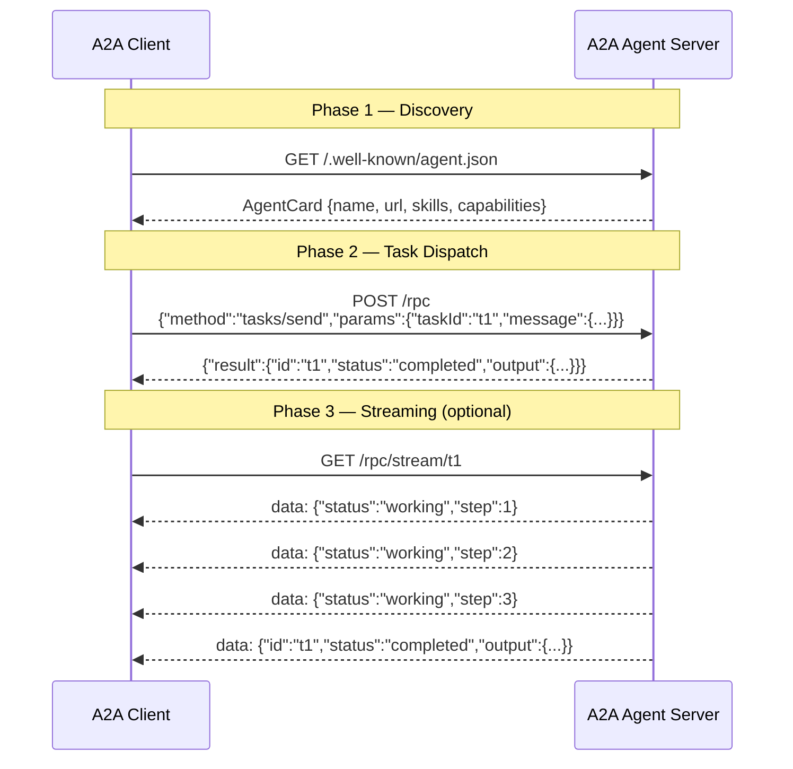

# Pattern 5 — Google A2A Protocol

## Overview

The **Google Agent-to-Agent (A2A) protocol** is an open standard for cross-vendor agent interoperability.
It solves the "unknown agent" problem: how does an agent *discover* what another agent can do, and
then *delegate work* to it in a standard way — without tight coupling?

A2A answers this with three building blocks:

| Building block | Description |
|---|---|
| **Agent Card** | A well-known JSON document that describes the agent's identity, capabilities, and skills |
| **Task lifecycle** | A simple state machine: `submitted → working → completed \| failed` |
| **Transport** | JSON-RPC 2.0 over HTTP for task dispatch, Server-Sent Events (SSE) for streaming |

## Protocol Spec Reference

- Full specification: <https://a2a-protocol.org/latest/specification/>
- Reference implementation: <https://github.com/a2aproject/A2A>

## When to use A2A / Trade-offs

**Use A2A when:**
- Agents are built by different teams or vendors and need to interoperate without sharing code
- You need a stable, published contract that can be versioned
- You want built-in streaming progress without polling

**Trade-offs:**
- More ceremony than a direct REST call (Agent Card + JSON-RPC envelope)
- Requires both sides to implement the spec; plain REST agents need an adapter
- Task state management (persistence, retries) is left to the implementation

## Architecture



### Security model

A2A treats agents as **opaque black boxes**: clients know only what is in the Agent Card.
Internal tool calls, credentials, and sub-agent chains are invisible to the caller.
Authentication is layered on top via standard HTTP mechanisms (Bearer tokens, mTLS).

## Directory layout

```
05-a2a-protocol/
├── agent_card.py        # Pydantic models (AgentCard, Task, Message, Part)
├── agent_server.py      # FastAPI server (discovery + RPC + SSE)
├── agent_client.py      # Demo client (all three interaction phases)
├── test_integration.py  # pytest suite (all endpoints, in-process)
├── requirements.txt
└── README.md
```

## Prerequisites

```
python -m pip install -r requirements.txt
```

Python 3.11+ required.

## How to run

### Start the server

```bash
cd 05-a2a-protocol
uvicorn agent_server:app --port 8005
```

### Run the client (in a second terminal)

```bash
cd 05-a2a-protocol
python agent_client.py
```

You will see four labelled phases printed with colour:
1. **Discovery** — Agent Card fetched and pretty-printed
2. **Task send** — JSON-RPC request/response
3. **SSE stream** — live event feed printed line by line
4. **Conversation** — clean input → output summary

## How to run tests

```bash
cd 05-a2a-protocol
pytest test_integration.py -v
```

All tests run in-process via `fastapi.testclient.TestClient` — no server process needed.
