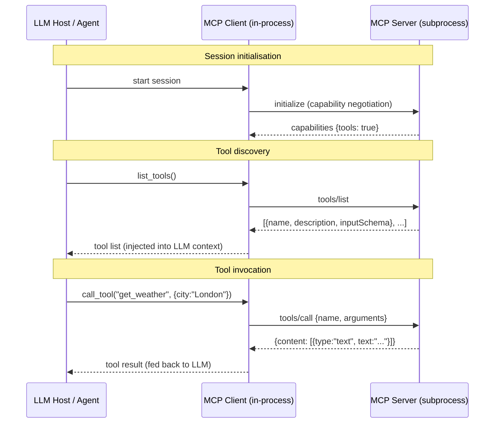

# Pattern 6 — Anthropic MCP (Model Context Protocol)

## Overview

**MCP (Model Context Protocol)** is an open standard by Anthropic that defines a typed,
versioned interface between LLM hosts and the tools/data sources they need.

Before MCP, every LLM application had to invent its own function-calling glue code.
MCP standardises that layer so a single MCP server can be used by any MCP-compatible host
(Claude Desktop, OpenAI, LangChain, custom agents, etc.) without modification.

## Components

| Role | Description |
|---|---|
| **Host** | The LLM application (e.g. Claude Desktop, an agent loop). Manages client sessions. |
| **Client** | One MCP session inside the host. Connected to exactly one server. |
| **Server** | Exposes tools, resources, and prompts. Runs in-process or as a subprocess. |

## Primitives

| Primitive | Purpose | Example |
|---|---|---|
| **Tool** | A callable function | `get_weather(city)` |
| **Resource** | A readable data source | `file://path/to/doc` |
| **Prompt** | A reusable prompt template | `summarise_document` |

This implementation demonstrates **tools** only — the most commonly used primitive.

## Transport options

| Transport | Use case |
|---|---|
| **stdio** | Local subprocess, simplest, zero config |
| **SSE** | Remote server behind HTTP, browser-friendly |
| **Streamable HTTP** | Bidirectional streaming over HTTP/2 |

We use **stdio** — the MCP SDK forks the server as a child process and
wires `stdin`/`stdout` as the message channel.

## How MCP complements A2A

- **A2A** solves agent-to-agent delegation (cross-vendor task hand-off)
- **MCP** solves LLM-to-tool/data integration (capability exposure)
- They are **orthogonal**: an A2A agent might internally use MCP to call tools,
  and an MCP server might orchestrate multiple A2A agents as tools

## Architecture



## Directory layout

```
06-mcp/
├── mcp_server.py        # FastMCP server with 3 tools (stdio transport)
├── mcp_client.py        # Async client: discover + invoke all tools
├── test_integration.py  # pytest suite (subprocess-based, no mocks)
├── requirements.txt
└── README.md
```

## Prerequisites

```bash
pip install -r requirements.txt
```

Python 3.11+ required.

## How to run

### Start the server standalone (optional — normally launched by client)

```bash
cd 06-mcp
python mcp_server.py
```

The server will block waiting for MCP messages on stdin.  Press `Ctrl-C` to stop.

### Run the client demo

The client launches the server automatically as a subprocess:

```bash
cd 06-mcp
python mcp_client.py
```

You will see four labelled phases:
1. Session initialisation
2. Tool list (names, descriptions, parameter schemas)
3. `get_weather` calls for three cities
4. `search_knowledge_base` and `create_summary` calls

## How to run tests

```bash
cd 06-mcp
pytest test_integration.py -v
```

Tests connect to the server via stdio subprocess — the same transport used in production.
No mocking of MCP internals: this exercises the real SDK end-to-end.

## Protocol Spec Reference

- MCP introduction: <https://modelcontextprotocol.io/introduction>
- Python SDK: <https://github.com/modelcontextprotocol/python-sdk>
