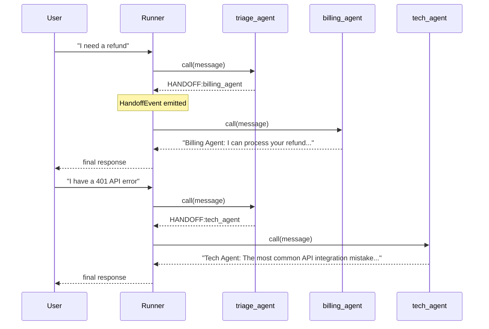

# Pattern 7: OpenAI Agents SDK — Handoff Pattern

## Overview

The **OpenAI Agents SDK** (formerly *Swarm*) organises multi-agent systems around
two core primitives:

| Primitive | Description |
|---|---|
| **Agent** | A stateless routine: system prompt + optional tools + list of agents it can hand off to |
| **Handoff** | A first-class transfer of control from one agent to another; the new agent receives the full conversation history |

This pattern implements a **triage + specialist** topology: a `triage_agent`
inspects every incoming message and routes it to either `billing_agent` or
`tech_agent`.  The specialists never hand off further.

> **Offline-first**: This implementation mocks all model calls. No API key is
> required. The mock engine in `mock_model.py` uses keyword matching to return
> scripted responses, including the `HANDOFF:<agent_name>` tokens that drive
> routing.

## Framework Concepts

### Agents as Stateless Routines
An agent does not hold conversation state — the *caller* (the Runner loop)
is responsible for carrying the message history between turns.  This makes
agents independently testable and trivially composable.

### Handoffs as First-Class Primitives
When a model decides to hand off, it returns a special signal (in the real SDK
this is a structured tool call; here we use a `HANDOFF:<name>` prefix).  The
Runner detects this signal, looks up the target in the current agent's
`handoffs` list, and switches control.  The handoff is logged as a
`HandoffEvent` in the SDK's tracing system.

### Context Variables
The real SDK threads a `RunContext` object through every node.  It carries
shared mutable state (e.g. user ID, session metadata) without being part of
the message history.  This pattern does not need shared state, so context
variables are omitted for clarity.

### Traces
Every run produces a hierarchical trace: which agent ran, how long it took,
whether a handoff occurred, and what tool calls were made.  The trace is
viewable in the OpenAI dashboard or can be exported to OTLP/Langfuse.

## Architecture



## File Structure

```
07-openai-agents-sdk/
├── agents_setup.py      # Agent dataclasses + build_agents() factory
├── mock_model.py        # Keyword-based scripted response engine
├── main.py              # Runner loop + demo conversations
├── test_integration.py  # pytest — routing + graph structure tests
├── requirements.txt
└── README.md
```

## Prerequisites

- Python 3.11+
- No API key needed (mock model)

```bash
cd 07-openai-agents-sdk
pip install -r requirements.txt
```

## How to Run

```bash
cd 07-openai-agents-sdk
python main.py
```

Expected output (abridged):

```
=== OpenAI Agents SDK — Handoff Pattern Demo ===
Agents defined: triage_agent, billing_agent, tech_agent
Entry point: triage_agent

────────────────────────────────────────────────────────────
Scenario: BILLING
User: I was charged twice for my subscription last month and I need a refund.
Trace:
  [turn 1] agent='triage_agent'
  [HandoffEvent] 'triage_agent' → 'billing_agent'
  [turn 2] agent='billing_agent'
Final response: Billing Agent: I can process your refund request...

Scenario: TECHNICAL
User: I keep getting a 401 error when calling the API — how do I debug this?
Trace:
  [turn 1] agent='triage_agent'
  [HandoffEvent] 'triage_agent' → 'tech_agent'
  [turn 2] agent='tech_agent'
Final response: Tech Agent: The most common API integration mistake...
```

## How to Run Tests

```bash
cd 07-openai-agents-sdk
pytest test_integration.py -v
```

## Comparison with Other Patterns

| Aspect | OpenAI Agents SDK | LangGraph | CrewAI |
|---|---|---|---|
| **Mental model** | Agents as stateless routines | Nodes in a directed graph | Crew members with roles |
| **Routing** | Handoff tokens in model output | Conditional edges | Sequential/hierarchical process |
| **State** | Message history + RunContext | Typed state dict | Task outputs |
| **Cycles** | Via recursive handoffs | First-class (compile-time) | Not idiomatic |
| **Best for** | Customer-facing routing, triage | Iterative workflows, complex branching | Role-based document pipelines |
| **Vendor lock-in** | OpenAI ecosystem | Framework-agnostic | Framework-agnostic |

### When to Use the Agents SDK
- Your agents map naturally to *specialists* (billing, tech, sales)
- You want OpenAI's built-in tracing and dashboard
- You need tight integration with OpenAI tools (function calling, file search, code interpreter)

### When to Use Something Else
- You need deterministic, auditable state transitions → **LangGraph**
- Your workflow is document/report generation with human roles → **CrewAI**
- You want full control over the conversation protocol → **AutoGen**
