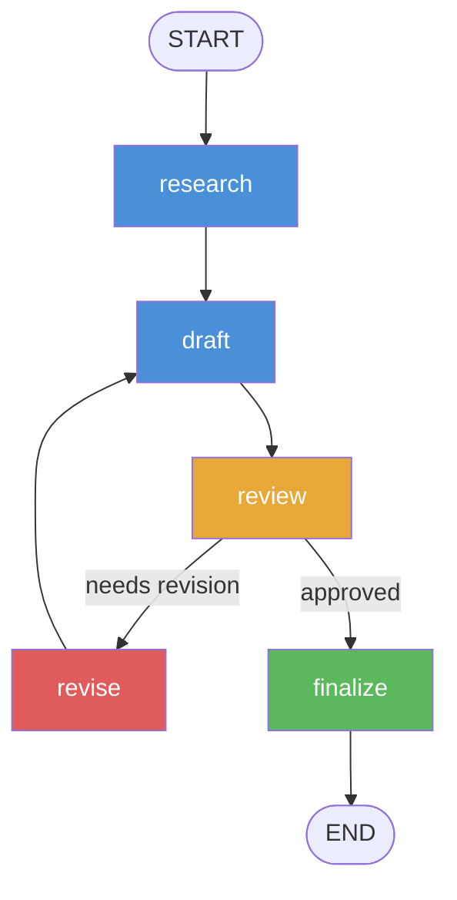

# Pattern 8: LangGraph — State Machine Pipelines

## Overview

**LangGraph** models multi-agent workflows as **directed graphs with shared state**.
Each node is a function that receives the full state, does its work, and returns
a partial update.  LangGraph merges updates automatically and follows the edges
(including *cycles*) to determine the next node.

This demo implements a **research → draft → review → revise → finalize** pipeline:
- A `research_node` gathers 3 mock findings.
- A `draft_node` writes a first draft.
- A `review_node` evaluates the draft and decides if revision is needed.
- A `revise_node` feeds back into `draft_node` (a **cycle**).
- A `finalize_node` produces the final document.

> **Offline-first**: All node functions return pre-written strings. No API key needed.

## Framework Concepts

### StateGraph and TypedDict State
The graph's shared state is a plain `TypedDict`.  Every node receives the *entire*
state and returns only the keys it changed.  LangGraph merges partial updates
automatically — this is safer than passing the dict by reference.

### Nodes and Edges
- `add_node(name, fn)` registers a function as a graph node.
- `add_edge(a, b)` adds a deterministic transition from `a` to `b`.
- `set_entry_point(name)` declares where execution begins.

### Conditional Edges (Branching)
```python
graph.add_conditional_edges(
    "review",        # source
    should_revise,   # fn(state) → str key
    {"revise": "revise", "finalize": "finalize"},
)
```
The routing function `should_revise` inspects the state and returns a string
key that maps to the next node.  This is how LangGraph implements `if/else`
branching without hard-coding it in the node function itself.

### Cycles for Iterative Refinement
LangGraph explicitly supports cycles — `revise → draft → review → revise` is
a valid loop.  The graph terminates when a conditional edge routes to `END`.
This is LangGraph's key differentiator from linear pipeline frameworks.

### Compile and Invoke
`graph.compile()` validates the graph (checks for dangling edges, unreachable
nodes) and returns a `CompiledGraph` with an `invoke()` method.  `invoke(state)`
runs the graph synchronously from the entry point to `END`.

## Architecture



## File Structure

```
08-langgraph/
├── state.py             # ResearchState TypedDict
├── nodes.py             # research, draft, review, revise, finalize node functions
├── graph.py             # Graph construction, conditional edges, main() runner
├── test_integration.py  # pytest — graph compilation, full run, node unit tests
├── requirements.txt
└── README.md
```

## Prerequisites

- Python 3.11+
- No API key needed (mock nodes)

```bash
cd 08-langgraph
pip install -r requirements.txt
```

## How to Run

```bash
cd 08-langgraph
python graph.py
```

Expected output (abridged):

```
=== LangGraph Research Pipeline Demo ===
Building graph ...
Initial state: topic='agent communication patterns'
Running graph ...

[research_node] Researching: 'agent communication patterns'
  + Finding 1: The A2A protocol...
  + Finding 2: Shared-memory patterns...
  + Finding 3: Capability advertisement...

[draft_node] Writing draft (revision #0) ...
  Draft written (412 chars)

[review_node] Reviewing draft (revision_count=0) ...
  Verdict: REVISION NEEDED
  Feedback: The draft covers the findings well but lacks concrete trade-off tables...

[revise_node] Revising based on feedback ...
  Revision #1 queued — returning to draft_node

[draft_node] Writing draft (revision #1) ...
  Draft written (578 chars)

[review_node] Reviewing draft (revision_count=1) ...
  Verdict: APPROVED

[finalize_node] Producing final document ...
  Final document ready (612 chars)

=== Graph Execution Complete ===
Revision cycles: 1
Findings collected: 3
```

## How to Run Tests

```bash
cd 08-langgraph
pytest test_integration.py -v
```

## Comparison with Other Patterns

| Aspect | LangGraph | OpenAI Agents SDK | CrewAI | AutoGen |
|---|---|---|---|---|
| **Mental model** | State machine / directed graph | Stateless routines + handoffs | Crew members + tasks | Conversational agents |
| **Cycles** | First-class | Via recursive handoffs | Not idiomatic | Via conversation loops |
| **State** | Typed dict, explicit | Message history | Task outputs | Chat messages |
| **Branching** | Conditional edges (functions) | Model-generated handoffs | Process type | Speaker selection |
| **Debugging** | Graph trace, node-level state | HandoffEvent trace | Task output | Conversation transcript |
| **Best for** | Iterative refinement, complex DAGs | Customer-facing triage | Document pipelines | Open-ended collaboration |

### When to Use LangGraph
- Your workflow has **cycles** (retry, revision, reflection loops).
- You need **deterministic, auditable** state transitions.
- You want to **unit-test each node** in isolation.
- You are using LangChain tools and want tight integration.

### When to Use Something Else
- Simple triage/routing without cycles → **OpenAI Agents SDK**
- Role-based document generation → **CrewAI**
- Open-ended multi-agent conversation → **AutoGen**
