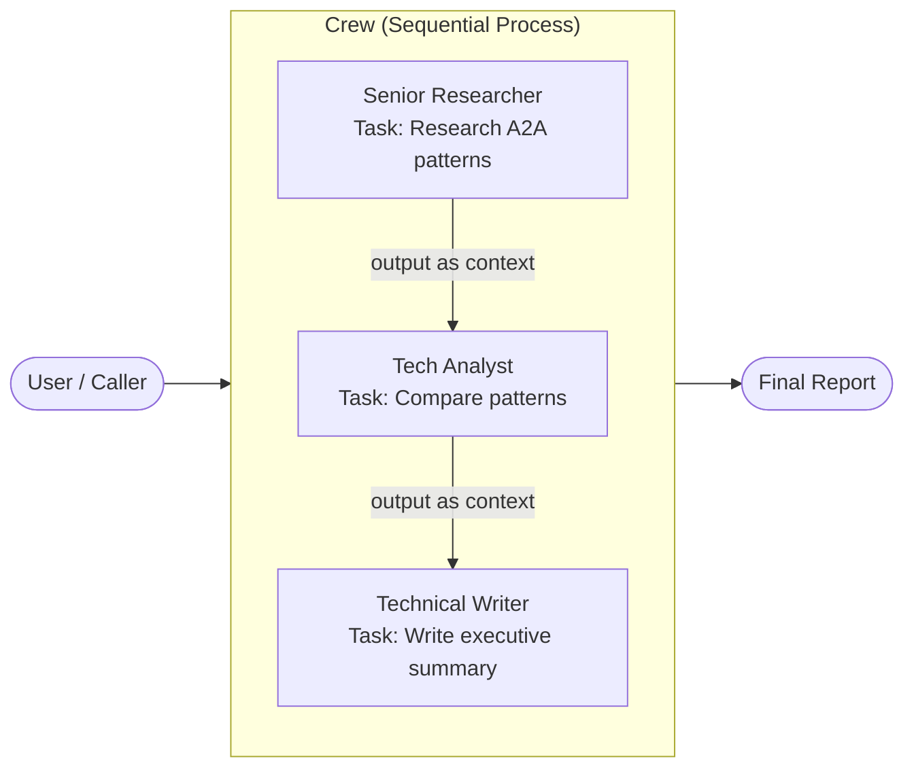

# Pattern 9: CrewAI — Role-Based Crew Execution

## Overview

**CrewAI** models multi-agent systems as a *crew* of specialists, each with a
distinct **role**, **goal**, and **backstory**.  Agents execute **tasks** — units
of work with a description and an expected output — in a configurable process
(sequential or hierarchical).

This demo implements a **research → analysis → writing** pipeline:
- A `researcher` discovers the 3 most important A2A patterns.
- An `analyst` compares them on coupling, scalability, and complexity.
- A `writer` synthesises an executive summary for engineering leadership.

> **Offline-first**: All LLM calls are intercepted by monkey-patching
> `agent.execute_task`. No API key is needed. The mock engine in `mock_llm.py`
> uses keyword matching to return scripted responses.

## Framework Concepts

### Agents: Role, Goal, Backstory
The persona triple is injected verbatim into the agent's system prompt.  CrewAI
uses this to shape how the underlying model responds — a "Senior Researcher"
with a distributed-systems backstory will (in a real run) produce more detailed
technical output than a generic assistant.

### Tasks: Description + Expected Output
A task defines *what* must be done and *what good looks like*.  CrewAI uses the
`expected_output` field to evaluate responses and optionally to format the
output (e.g., requesting a markdown table).

### Processes
| Process | Description |
|---|---|
| `Process.sequential` | Tasks execute in order; each task's output is available as context for later tasks |
| `Process.hierarchical` | A manager LLM allocates tasks to agents dynamically |

This demo uses `Process.sequential` — the most transparent and debuggable option.

### Delegation
When `allow_delegation=True`, an agent can sub-delegate part of its task to
another crew member.  We disable this for clarity.

### Memory
CrewAI supports short-term memory (in-context), long-term memory (vector store),
and entity memory.  Not used in this demo but easy to enable via `memory=True`.

### Context Chaining
Tasks can declare `context=[other_task]`.  CrewAI appends the referenced task's
output to the agent's prompt — this is how the analyst sees the researcher's
findings without explicit message passing.

## Architecture



## File Structure

```
09-crewai/
├── mock_llm.py          # Scripted response engine + MockLLM class
├── crew.py              # Agent + Task + Crew definitions; mock patch
├── main.py              # Kicks off the crew and prints results
├── test_integration.py  # pytest — structure + execution tests
├── requirements.txt
└── README.md
```

## Prerequisites

- Python 3.11+
- No API key needed (mock LLM)

```bash
cd 09-crewai
pip install -r requirements.txt
```

## How to Run

```bash
cd 09-crewai
python main.py
```

Expected output (abridged):

```
=== CrewAI A2A Patterns Research Demo ===
Crew members: Senior Researcher, Tech Analyst, Technical Writer
Process: Sequential

Kicking off crew ...

[researcher] executing task: Research the 3 most important agent-to-agent...
Output (1 124 chars):
## Research Report: Agent-to-Agent (A2A) Communication Patterns
...

[analyst] executing task: Compare the 3 A2A patterns identified by the researcher...
Output (987 chars):
## Comparative Analysis: A2A Patterns
| Dimension | Direct Request-Response | ...

[writer] executing task: Write an executive summary of the A2A pattern research...
Output (812 chars):
## Executive Summary: Agent Communication Patterns
...

=== Crew Execution Complete ===
Final Output (writer's executive summary):
## Executive Summary: Agent Communication Patterns
...
```

## How to Run Tests

```bash
cd 09-crewai
pytest test_integration.py -v
```

## Comparison with Other Patterns

| Aspect | CrewAI | LangGraph | OpenAI Agents SDK | AutoGen |
|---|---|---|---|---|
| **Mental model** | Crew members + tasks | Graph nodes + state | Stateless routines | Conversational agents |
| **Structure** | Role/goal/backstory | Node functions | Agent instructions | System prompts |
| **Process** | Sequential / hierarchical | Conditional edges + cycles | Handoff chain | Speaker selection |
| **State** | Task outputs + context | Typed dict | Message history | Chat messages |
| **Delegation** | First-class (allow_delegation) | Manual via nodes | Via handoffs | Via group chat |
| **Best for** | Document pipelines, report generation | Iterative refinement | Triage / routing | Open-ended dialogue |

### When to Use CrewAI
- Your workflow maps naturally to **human roles** (researcher, analyst, writer).
- Tasks are **sequential** and each step builds on the previous one.
- You want a high-level, opinionated API with minimal boilerplate.
- The output is a **document or report** (not a real-time decision).

### When to Use Something Else
- You need **cycles** or complex branching → **LangGraph**
- You need **deterministic routing** with explicit handoffs → **OpenAI Agents SDK**
- You want **conversational, iterative** agent collaboration → **AutoGen**
