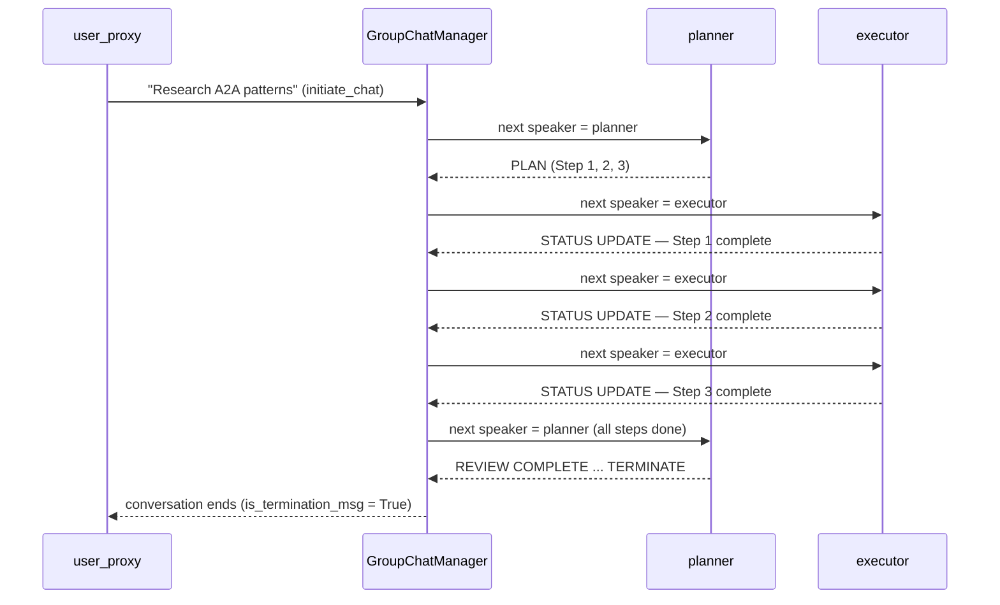

# Pattern 10: AutoGen — Conversational Multi-Agent Group Chat

## Overview

**AutoGen** (Microsoft) models multi-agent coordination as a *conversation*:
agents exchange natural-language messages in a shared channel called a
**GroupChat**.  Unlike frameworks that define explicit pipelines or graphs,
AutoGen lets agents negotiate, plan, and execute through dialogue.

This demo implements a **plan → execute → approve** workflow:
- A `user_proxy` sends the initial task.
- A `planner` agent decomposes the task into a numbered plan.
- An `executor` agent carries out each step and reports back.
- The `planner` reviews all outputs and sends `TERMINATE`.

> **Offline-first**: All LLM calls are replaced with scripted replies via
> AutoGen's `register_reply()` mechanism. No API key is needed.

## Framework Concepts

### ConversableAgent
The base class for all AutoGen agents.  Every agent can:
- **Send** messages to other agents or to a group.
- **Receive** messages and generate replies (via LLM, function, or script).
- **Register** custom reply functions that run before the LLM call.

### UserProxyAgent
A specialised `ConversableAgent` that represents the human (or an automated
proxy).  Key parameters:
- `human_input_mode="NEVER"`: fully automated, no keyboard input.
- `is_termination_msg`: a function that checks whether to stop the conversation.
- `code_execution_config`: whether to run code blocks in replies.

### GroupChat + GroupChatManager
`GroupChat` holds the shared message history and the list of participating agents.
`GroupChatManager` drives the conversation: at each turn it selects the next
speaker (using an LLM or a custom function) and asks that agent to reply.

This is AutoGen's key differentiator: **speaker selection** can be:
- **Auto** (an LLM reads the conversation and picks the best next speaker).
- **Round-robin** (agents take turns).
- **Custom function** (deterministic logic, as used in this demo).

### Human-in-the-Loop
Set `human_input_mode="ALWAYS"` or `"TERMINATE"` to pause and ask a real human
to approve or redirect the conversation.  This is invaluable for high-stakes
decisions.

### Nested Chats
AutoGen supports nested conversations: an agent can spin up a private
sub-conversation with another agent to solve a subtask, then return the result
to the main group.  Not used here but a powerful pattern for complex delegation.

## Architecture



## File Structure

```
10-autogen/
├── mock_responses.py    # Scripted planner + executor responses; state reset
├── agents.py            # Agent definitions, reply function registration, GroupChat
├── main.py              # Initiates group chat, prints transcript
├── test_integration.py  # pytest — mock responses, agent structure, full run
├── requirements.txt
└── README.md
```

## Prerequisites

- Python 3.11+
- No API key needed (mock replies)

```bash
cd 10-autogen
pip install -r requirements.txt
```

## How to Run

```bash
cd 10-autogen
python main.py
```

Expected output (abridged):

```
=== AutoGen Group Chat Demo ===
Agents: user_proxy, planner, executor
Mode: GroupChat with custom speaker selection

Initiating conversation ...

[planner] → PLAN:
I have analysed the task: "Research and document agent communication patterns."
Here is the execution plan:
Step 1: Research direct request-response pattern ...

[executor] → STATUS UPDATE — Step 1 complete: Direct Request-Response ...

[executor] → STATUS UPDATE — Step 2 complete: Event-Driven Pub/Sub ...

[executor] → STATUS UPDATE — Step 3 complete: Hierarchical Delegation ...

[planner] → REVIEW COMPLETE — All steps approved. ... TERMINATE

=== Conversation Transcript ===
[1] USER_PROXY
Research and document the 3 most important ...

[2] PLANNER
PLAN: I have analysed the task ...
...

=== Done ===
Total messages in conversation: 6
```

## How to Run Tests

```bash
cd 10-autogen
pytest test_integration.py -v
```

## Comparison with Other Patterns

| Aspect | AutoGen | LangGraph | OpenAI Agents SDK | CrewAI |
|---|---|---|---|---|
| **Mental model** | Conversational agents | State machine graph | Stateless routines | Crew members + tasks |
| **Coordination** | Natural language messages | Typed state updates | Handoff tokens | Task outputs |
| **Speaker selection** | LLM / custom function | Conditional edges | Agent handoffs | Process order |
| **Human-in-the-loop** | First-class (`ALWAYS`/`TERMINATE`) | Manual checkpoint | Via human agent | Via human task |
| **Flexibility** | Very high (open-ended dialogue) | High (graph structure) | Medium (handoff chain) | Medium (process type) |
| **Best for** | Open-ended collaboration, code generation | Iterative refinement | Triage / routing | Document pipelines |

### When to Use AutoGen
- Your agents need to **negotiate** or **critique each other's work** in dialogue.
- You want **human-in-the-loop** checkpoints at runtime.
- The workflow is **open-ended** — you cannot pre-define every step.
- You are building a **code generation** system (executor can run code blocks).

### When to Use Something Else
- You need **deterministic, auditable** state transitions → **LangGraph**
- You need **fast triage routing** with clear handoffs → **OpenAI Agents SDK**
- Your workflow is **document/report generation** with human roles → **CrewAI**

### Microsoft Agent Framework
AutoGen is the foundation of Microsoft's Agent Framework (Semantic Kernel
multi-agent extensions, Azure AI Agent Service).  Production deployments add:
- Persistent message stores (Azure Cosmos DB)
- Role-based access control on group chats
- Observability via Azure Monitor / OpenTelemetry
