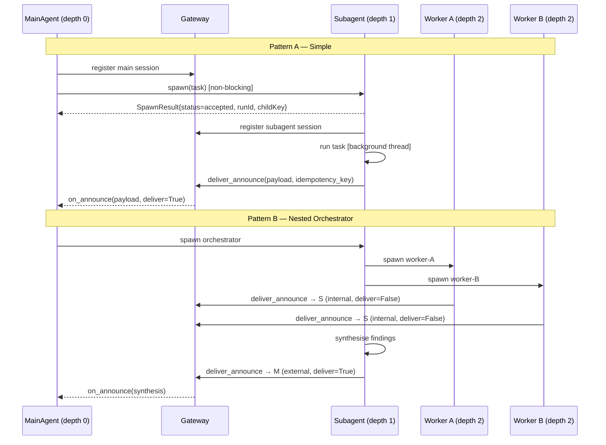

# Pattern 11: OpenClaw — Announcement-Based Subagent Coordination

## Overview

**OpenClaw** is Anthropic's internal agent runtime powering Claude Code and related
agent harnesses.  Its central coordination primitive is the **announcement**: every
subagent, when it finishes, *announces* its result back to the requester rather than
returning a value through a call stack.  This decouples execution from delivery and
enables non-blocking, depth-limited, tree-shaped agent hierarchies.

This demo models three OpenClaw interoperability sub-patterns in pure Python — no
real OpenClaw installation required.

> **Offline-first**: no LLM API calls, no external services. Everything runs
> in-process with `threading`.

---

## Three Sub-Patterns

### Pattern A — Simple Subagent + Announcement

The baseline: a main agent spawns one subagent *non-blocking* (returns immediately),
the subagent does its work in a background thread, then announces its result back
through the **Gateway**.

```
MainAgent (depth 0)
  │
  ├── sessions_spawn("research-agent")   ← returns {status, runId, childKey} immediately
  │
  │                           [background]
  │   research-agent ──── task ────► result
  │                               │
  │   ◄──── runSubagentAnnounceFlow ────┘
  │
  └── on_announce(payload, deliver=True)  ← user-facing delivery
```

Key mechanics:
- **`ANNOUNCE_SKIP` sentinel** — if the subagent's final reply is exactly this
  string, the announce step is suppressed entirely (used for "quiet" background tasks).
- **Outcome classification** — `ok / error / timeout / unknown` derived from runtime
  signals, never from model text.
- **Retry with exponential backoff** — on transient gateway failures:
  5 s → 10 s → 20 s (8 ms → 16 ms → 32 ms in test mode).
- **Idempotency store** — the gateway tracks a seen-key set; duplicate announces are
  dropped silently.

---

### Pattern B — Nested Orchestrator (`maxSpawnDepth=2`)

A depth-limited tree: main (depth 0) spawns an orchestrator (depth 1), which
spawns two parallel worker subagents (depth 2).  Workers announce to the orchestrator
(internal injection, `deliver=False`); the orchestrator synthesises and announces
to main (external delivery, `deliver=True`).

```
MainAgent (depth 0)
  └── Orchestrator (depth 1)
        ├── Worker A (depth 2) ──► [internal announce → Orchestrator]
        └── Worker B (depth 2) ──► [internal announce → Orchestrator]
                                    │
                      Orchestrator synthesises
                                    │
                          ──► [external announce → MainAgent]
```

Session key shapes (mirroring OpenClaw exactly):

| Depth | Key format |
|-------|-----------|
| 0 — main | `agent:<id>:main` |
| 1 — subagent | `agent:<id>:subagent:<uuid>` |
| 2 — sub-subagent | `agent:<id>:subagent:<uuid>:subagent:<uuid>` |

The Gateway's delivery rule: if the requester's depth is 0, deliver externally
(`deliver=True`); if depth ≥ 1, inject internally (`deliver=False`).

---

### Pattern C — ACP Session (Agent Client Protocol)

ACP is OpenClaw's bridge to *external* coding harnesses: Claude Code, Codex, Gemini
CLI, etc.  An ACP session differs from a native subagent in three ways:

| | Native Subagent | ACP Session |
|--|--|--|
| Session key | `…:subagent:<uuid>` | `…:acp:<uuid>` |
| Runtime | Sandboxed in-process | External host process |
| Progress | Final announce only | `streamTo="parent"` system events |

`streamTo="parent"` streams incremental progress back to the requester as system
events (not user-visible messages), so the parent has visibility into harness progress
without waiting for a final result.

```
MainAgent
  └── ACP harness: claude-code (key: agent:main:acp:<uuid>)
        │  ← [stream→parent] "ACP harness started..."
        │  ← [stream→parent] "ACP harness finished: ..."
        └── (deregisters on completion — no final announce for ACP)
```

---

## Architecture



---

## File Structure

```
11-openclaw-announcement/
├── gateway.py          # Session registry, AnnouncePayload, idempotency store, routing
├── subagent.py         # Subagent runtime: spawn, announce flow, retry, AcpSession
├── main_agent.py       # MainAgent: runs all three patterns
├── test_integration.py # 24 pytest tests covering all sub-patterns
├── requirements.txt
└── README.md
```

---

## Prerequisites

- Python 3.11+
- No API key needed

```bash
cd 11-openclaw-announcement
pip install -r requirements.txt
```

---

## How to Run

```bash
cd 11-openclaw-announcement
python main_agent.py
```

Expected output (abridged):

```
============================================================
  PATTERN A — Simple Subagent + Announcement
============================================================

[Gateway] register  key=agent:main:main  depth=0
[Subagent] spawned  key=agent:main:subagent:a1b2c3d4  depth=1  task='distributed systems fault tolerance'
[MainAgent] spawn returned immediately: SpawnResult(status='accepted', ...)

[subagent-announce]
  source:      subagent
  child-key:   agent:main:subagent:a1b2c3d4
  label:       research-agent
  status:      completed successfully
  result:      Research finding on '...': key insight about tolerance stability
  stats:       runtime=51ms  tokens=~9

[Gateway] announce delivery  child=...  requester=agent:main:main  mode=external→user

[MainAgent] announce received [user-facing]
  from:    agent:main:subagent:a1b2c3d4
  label:   research-agent
  status:  completed successfully
  result:  Research finding on ...

============================================================
  PATTERN B — Nested Orchestrator (maxSpawnDepth=2)
============================================================
...
  [Orchestrator] synthesis complete → announcing to main

============================================================
  PATTERN C — ACP Session (External Harness)
============================================================
[ACP] spawn  harness=claude-code  key=agent:main:acp:...  stream_to_parent=True
[ACP stream→parent]  ACP harness started...
[ACP stream→parent]  ACP harness finished: Harness completed: refactor the authentication...
```

---

## How to Run Tests

```bash
cd 11-openclaw-announcement
pytest test_integration.py -v
```

All 24 tests pass with no external dependencies.

---

## Key Concepts vs. Other Patterns

| Concept | OpenClaw | Pattern 2 (Hierarchical Delegation) | AutoGen Nested Chat |
|---------|----------|-------------------------------------|---------------------|
| **Spawn** | Non-blocking, fire-and-forget | Synchronous worker call | Nested `initiate_chat` |
| **Result delivery** | Announce via gateway | Return value up call stack | Chat message back to parent |
| **Depth limit** | `maxSpawnDepth` enforced | Implicit (no built-in limit) | Unlimited by default |
| **Idempotency** | Built-in seen-key store | Not applicable | Not applicable |
| **External harnesses** | ACP session (`:acp:` key) | Not supported | Not supported |
| **Progress streaming** | `streamTo="parent"` | Not applicable | Human-in-the-loop only |

### When OpenClaw's Announce Pattern Shines

- Agent trees where tasks run for seconds-to-minutes and you don't want to block
  the parent's main loop.
- Nested orchestration where intermediate layers must synthesise before reporting up.
- Integrating external coding agents (Claude Code, Codex) as first-class participants
  in an orchestration graph, with live progress visibility.
- Systems requiring at-least-once delivery guarantees (idempotency + retry backoff).

### When to Use Something Else

- You need synchronous, predictable call stacks → **Pattern 2 (Hierarchical Delegation)**
- Your agents talk to each other via messages, not results → **AutoGen GroupChat**
- You need graph-based conditional routing with typed state → **LangGraph**
