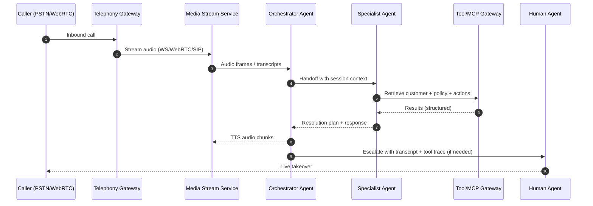
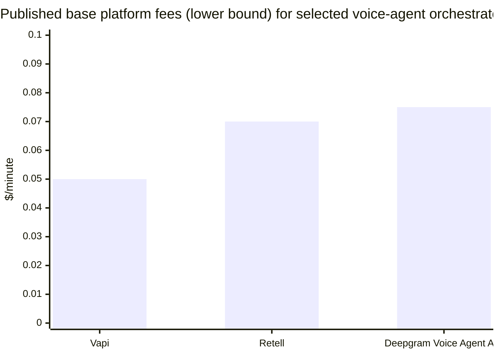

# State of the Art in Agent-to-Agent Systems for AI Voice Agents in Customer Support

## Executive summary

As of **26 Feb 2026**, the “state of the art” for customer-support voice agents is converging on **orchestrated, multi-agent systems** with (a) **explicit handoffs** between specialized agents, (b) **tool and context interoperability** via standard interfaces, and (c) **production-grade real-time speech pipelines** that treat latency, observability, and safety as first-class concerns. citeturn5search18turn21view0turn6search0turn6search3turn1search7

Several externally visible “stack shifts” are especially relevant if you are joining a company building customer-support voice agents:

- **Agent interoperability is standardizing.** Two protocols increasingly referenced in enterprise agent stacks are **A2A** for *agent-to-agent communication across vendors/frameworks* (JSON-RPC 2.0 over HTTPS; agent discovery; modality negotiation; async/streaming task lifecycle) and **MCP** for *tool/data access interoperability* (standardized client↔server interface). citeturn15view0turn4search0turn4search16turn5search15turn11search13  
- **Voice systems are splitting into a “media plane” and “control plane.”** Real-time audio (WebRTC/SIP/WebSocket) is increasingly handled separately from business logic and tool execution (server-side “sideband” or control channels), explicitly to improve security and reduce client exposure. citeturn1search8turn1search28turn1search36turn1search14  
- **Evaluation is moving from single-turn scoring to trace- and workflow-level evaluation.** Tool-use and multi-step agents are being evaluated via multi-turn offline/online benchmarks and “trace grading,” supported by new platform features (e.g., multi-turn evals) and dedicated evaluation APIs. citeturn7search5turn7search0turn5search0turn10search34turn10search18  
- **Safety and security are increasingly benchmarked as “agentic risks,” not just model risks.** Prompt injection, memory poisoning, and tool-abuse are now benchmarked end-to-end in agent settings (e.g., ASB), and emergent multi-agent dynamics are treated as distinct safety surfaces (e.g., MAEBE). citeturn20view0turn10search11turn10search7

**Unspecified constraints (explicitly noted):** Your prompt didn’t specify target concurrency/call volume, latency targets, budget/unit economics, cloud/provider constraints, regulated-domain requirements (e.g., HIPAA/PCI), or integration endpoints (CRM/CCaaS). These materially change architectural choices (e.g., WebRTC vs SIP, single-tenant vs shared infra, self-host vs managed). citeturn22view0turn9search0

## Definitions and taxonomy of agent-to-agent interactions

Modern “agent-to-agent” (A2A) systems for customer-support voice agents usually mean **multiple autonomous or semi-autonomous components** that collaborate through **explicit message passing and control transfer**, rather than a single monolithic prompt. The most useful taxonomy today combines (i) *collaboration mechanisms* from recent LLM multi-agent surveys with (ii) *protocol-level interoperability* concepts emerging in enterprise stacks. citeturn10search0turn15view0turn4search0turn6search3turn5search18

### Coordination

**Coordination** is the umbrella category: agents align actions to a shared objective while managing dependencies (who does what, when, and with which resources). A practically useful breakdown (consistent with recent surveys) is:  
- **Actors:** which agents participate (triage, specialist, compliance, tool-proxy). citeturn10search0turn21view0  
- **Structure:** centralized coordinator vs peer-to-peer vs hierarchical trees/graphs. citeturn10search0turn6search0turn6search24  
- **Protocols:** explicit routing, shared scratchpads/state machines, or formal task/plan exchange. citeturn10search0turn15view0turn10search34  

In customer-support voice, coordination most often appears as **triage → delegate → synthesize → resolve/escalate** patterns (see orchestration diagrams below), and the primary engineering problem becomes: *coordination without compounding latency and failure probability*. citeturn21view0turn1search7turn5search18

### Delegation and handoff

**Delegation** is when a “parent” agent assigns a subtask to another agent but keeps responsibility for the overall conversation outcome. **Handoff** is stronger: control of the conversation is transferred to a different agent (sometimes permanently for a session). These concepts are explicit in multiple agent SDKs/frameworks:  
- The (now replaced) experimental Swarm framework centered “handoffs” as a primary abstraction and illustrates a lightweight loop: get completion → execute tool calls → switch agent if needed → repeat. citeturn21view0  
- The OpenAI Agents SDK explicitly describes handoffs to specialized agents and retaining a full trace of the run. citeturn18view0turn5search18  

**Why it matters for voice:** in phone support, handoff is the “unit operation” for (a) moving from triage to domain expertise, and (b) moving from automation to a human agent (or to a human-supervisor workflow), with minimal repetition and maximal context retention. citeturn24view0turn19view0turn17search1

### Negotiation

In customer-support A2A, “negotiation” is usually not game-theoretic bargaining; it is **capability and modality negotiation**, such as:  
- selecting interaction modality (text, forms, structured JSON, streaming),  
- deciding which agent can legally/technically perform an action,  
- agreeing on task lifecycle events for long-running work. citeturn15view0turn4search1turn11search13  

The **A2A Protocol** explicitly calls out negotiation of modalities and secure collaboration among opaque agents as a core design goal. citeturn15view0turn4search1

### Multi-agent planning

Multi-agent planning in customer support is usually a blend of:  
- **workflow graphs / state machines** (deterministic control), and  
- **LLM-driven planning** (adaptive decomposition/routing), sometimes guided by hierarchical planning ideas when tasks are long-horizon and constrained. citeturn6search24turn10search6turn4search6turn11search8  

Recent benchmarks target planning and scheduling with explicit multi-agent dependencies (e.g., REALM-Bench). citeturn10search6

### Tool use as “agent-to-system” and “agent-to-agent via tools”

In practice, tool use creates two common patterns:
- **Tool proxy agents**: a specialist agent whose only job is safe, typed access to systems (CRM, billing, refunds). This aligns with modern “remote MCP servers” and built-in tool concepts. citeturn5search15turn4search0turn11search8  
- **Tools as agents**: when the interface is A2A, an “agent endpoint” can represent an opaque downstream service with its own goals and policies. citeturn15view0turn4search13  

### Emergent behavior

Emergent behavior refers to group dynamics that cannot be predicted from single-agent behavior alone—especially relevant for safety. Recent work argues multi-agent ensembles can show **non-linear effects** (peer pressure, convergence artifacts, brittle moral preferences under framing changes) and demands evaluation at the “ensemble” level, not just the model level. citeturn10search11turn10search7

## Technical architectures and integration patterns for production voice agents

Production voice agents combine **real-time media** with **agent orchestration**. Most architectures can be understood as 4 layers—media transport, speech perception/generation, agent runtime/orchestration, and enterprise integration—and a cross-cutting operations layer (security, observability, governance). citeturn1search7turn22view0turn5search18turn6search3turn7search3

### Media plane: real-time audio transport

Typical inbound voice channels are implemented via:
- **Telephony gateways** that stream call audio to your infra (usually WebSockets), such as “Media Streams” that provide raw audio from a live call and can be configured as unidirectional or bidirectional. citeturn1search2turn1search14turn1search6  
- **Browser/mobile WebRTC** sessions for low-latency conversational audio; several model APIs explicitly recommend WebRTC for client integrations. citeturn1search8turn1search36turn1search4  
- **SIP-based connectivity**, increasingly including “direct-to-model” or “model-terminated” SIP in realtime model APIs (useful for CCaaS interop), though most enterprises still keep tool logic server-side. citeturn1search28turn1search16turn1search8  

**Latency note:** media transport decisions dominate perceived responsiveness; vendors explicitly market sub-second or sub-500ms targets for “natural” conversations, but end-to-end latency is a system property (transport + STT + LLM + TTS + orchestration). citeturn23view0turn22view0turn2search10turn2search15

### Speech pipeline: ASR/NLU and TTS

Two main patterns exist:

- **Cascaded STT → LLM → TTS pipeline** (still the most common in production):  
  - Real-time STT APIs advertise low-latency streaming (e.g., 300ms P50 for a streaming API) and sometimes emphasize transcript stability to avoid mid-conversation “rewrites.” citeturn2search10turn2search2  
  - TTS vendors explicitly productize low-latency models (e.g., “Flash” variants) for conversational use. citeturn2search15turn2search11  
  - Voice-agent frameworks focus heavily on turn detection and interruptions (“barge-in”), because cascaded pipelines otherwise feel sluggish or talk over the user. citeturn1search7turn22view0  

- **Native speech-to-speech “realtime” models** (increasingly available):  
  - Realtime model APIs explicitly support low-latency session state updates and audio streaming; they can accept audio input and produce audio output directly. citeturn1search4turn1search12turn1search16  
  - Some cloud platforms list “native audio” models as GA in late 2025, indicating rapid maturation of speech-to-speech at the platform level. citeturn11search5  

### Agent runtime: state sharing, session management, and handoff

In customer support, the runtime is usually responsible for:

- **Conversation state**: maintaining near-term memory, tool outputs, and compliance annotations (e.g., consent, verification steps). Agent SDKs increasingly emphasize explicit “conversation state” and full trace retention for debugging and compliance. citeturn18view0turn5search18turn11search8  
- **Session handoff**: from triage to specialist agents and from automation to a human agent. The same “handoff” idea appears in lightweight educational frameworks and production SDKs. citeturn21view0turn5search18turn19view0  
- **Latency-aware orchestration**: parallelizing subcalls where safe (e.g., fetch customer profile while clarifying intent) and avoiding agent debates during live audio unless necessary. Practical limitations of parallel agent handoffs are highlighted in real SDK discussions and patterns. citeturn21view0turn5search12turn29view0  

### Enterprise integration: tool calls, connectors, and identity

Modern stacks are converging on two complementary integration styles:

- **Typed tool calls + policy enforcement** (classic agent tool use): tool contracts are explicit; the runtime mediates calls; approvals and audits are possible. This is core to modern agent SDKs and “use tools” guides. citeturn5search15turn18view0turn6search3  
- **Protocol-based connectors**: MCP formalizes tool/data access via “MCP servers,” enabling reuse and vendor neutrality; several agent platforms explicitly highlight MCP as a key interoperability layer. citeturn4search0turn6search3turn5search15  

### Observability: tracing, evaluations, and ops metrics

For customer support, “observability” must unify **media + agent + tools**:

- **Trace-level visibility** is now a core product differentiator; agent SDKs emphasize “full trace” capture, and enterprise platforms highlight session tracing and guardrail logging. citeturn18view0turn11search6turn7search3  
- **Multi-turn evaluations** are explicitly productized to measure end-to-end interaction outcomes rather than isolated messages. citeturn7search5turn7search1  
- Open standards like **OpenTelemetry** are being extended toward “AI agent observability” to reduce fragmentation and integrate with existing APM stacks. citeturn7search3turn6search34  

### Architectural patterns table

| Pattern | Agent-to-agent interaction style | Key integration points | Strengths | Main tradeoffs |
|---|---|---|---|---|
| Single-agent voice bot with tool use | None / implicit (single controller) | STT/TTS + tool calls | Lowest complexity and latency amplification | Hard to scale domain coverage; brittle prompts; limited parallelism citeturn5search15turn1search7 |
| Triage agent → specialist handoff | Delegation + handoff | Shared session state; routing policy | Scales knowledge domains; clearer ownership boundaries | Adds orchestration overhead and “handoff correctness” risk citeturn21view0turn5search18turn10search0 |
| Orchestrator + tool-proxy agents | Delegation (tool mediation) | MCP/tool gateways; approval hooks | Strong security posture; typed actions; auditable | Tool layer can dominate latency; more infra to operate citeturn5search15turn4search0turn20view0 |
| Parallel subagents + synthesis | Coordination + aggregation | Concurrency control; merging | Faster resolution for info-gathering tasks (when safe) | Higher cost; inconsistent outputs; requires synthesis discipline citeturn10search0turn5search12turn10search34 |
| Cross-vendor agent mesh | A2A interoperability | A2A endpoints + enterprise auth | Enables “best agent per task” across owners | Hard governance; trust boundaries; standard maturity risk citeturn15view0turn4search1turn6search3 |

### Typical end-to-end call flow with multi-agent orchestration

This flow reflects practical “separation of concerns”: keep the media plane streaming continuously while the agent runtime handles handoffs and tool calls via secure server-side channels. citeturn1search2turn1search28turn21view0turn5search15turn19view0

## Commercial products, platforms, and open-source projects

The ecosystem can be organized by where a product sits in the stack: **interoperability protocols**, **agent orchestration runtimes**, **voice-agent infrastructure**, and **enterprise CX platforms**. The table below emphasizes agent-to-agent relevance, dates, APIs/protocols, and any publicly stated pricing.

### Comparative landscape table

| Layer | Product / project | Public milestone date | Core features relevant to agent-to-agent CX | Interfaces / APIs | Pricing model (public) |
|---|---|---:|---|---|---|
| Agent interop protocol | A2A (by entity["company","Google","cloud ai platform"] contributors; Linux Foundation project) | Announced **9 Apr 2025**; shows releases (e.g., **v0.3.0 Jul 2025**) | Agent discovery (“Agent Cards”), modality negotiation, sync + streaming + async tasks; designed for opaque agents across servers/orgs | JSON-RPC 2.0 over HTTP(S); SSE + push options | Spec + SDKs are open; enterprise cost is in hosting/integration citeturn4search1turn15view0 |
| Tool/data interop protocol | MCP (introduced by entity["company","Anthropic","ai company"]; open spec) | Intro **25 Nov 2024**; spec revision **25 Nov 2025**; extensions **26 Jan 2026** | Standard “tool and context” interface (MCP servers/clients), now evolving toward richer UX (“apps”) | MCP client/server; schema-defined tools/resources | Spec open; operational cost in hosting + governance citeturn4search16turn4search0turn4search32turn4search24 |
| Agent orchestration SDK | OpenAI Agents SDK (entity["company","OpenAI","ai company"]) | Released **Mar 2025** (changelog); active releases through **Feb 2026** | Handoffs, tool use, streaming, tracing (“full trace of what happened”); designed for multi-agent workflows | Built around Responses API + tools; supports remote MCP servers | SDK open-source; usage billed via API pricing citeturn5search31turn5search18turn5search1turn5search2turn5search15 |
| Realtime speech API | OpenAI Realtime API | Developer note update **12 Sep 2025**; deprecations noted 2025–2026 | Low-latency speech-to-speech; WebRTC/SIP connectivity; session events; sideband control channel pattern for secure tool use | WebRTC, WebSocket, SIP; session events & buffers | Usage billed via API pricing; models evolve (deprecation policy applies) citeturn1search4turn1search8turn1search28turn7search13turn5search4 |
| Durable agent framework | LangGraph (by entity["company","LangChain","ai tooling company"]) | **22 Oct 2025** GA (v1.0) | Declarative graphs for multi-step, multi-agent control; production stability focus; integrates with evaluation/observability | Python/TS libs; integrates with LangSmith | OSS core; commercial hosting/ops via associated platform offerings citeturn6search0turn6search8turn6search24 |
| Enterprise agent framework | Microsoft Agent Framework (by entity["company","Microsoft","software company"]) | Announced **1–2 Oct 2025**; moving toward RC/GA by early 2026 | Unifies AutoGen + Semantic Kernel foundations; emphasizes enterprise readiness incl. approvals/security/observability, and explicitly references MCP/A2A/OpenAPI interoperability | .NET libraries + platform integrations | OSS framework; commercial packaging via Microsoft platforms/services citeturn6search15turn6search3turn6search11turn6search19 |
| Multi-agent framework | CrewAI (by entity["company","CrewAI","agent orchestration company"]) | OSS v1.0 **9 Oct 2025** | “Crews” of role-based agents and event-driven flows; enterprise control + telemetry hooks | Python ecosystem; enterprise platform add-ons | OSS core + enterprise offerings (pricing typically sales-led) citeturn6search13turn6search29turn6search1 |
| Voice agent framework | LiveKit Agents (by entity["company","LiveKit","realtime comms company"]) | Agents 1.0: **Apr 2025** (Python), **Aug 2025** (Node) | Production voice agent SDK: STT–LLM–TTS pipeline, turn detection, interruptions, orchestration, load balancing, k8s compatibility | Plugins for model providers; agent server architecture | OSS (Apache 2.0); Cloud has free tier minutes and paid plans citeturn1search7turn1search27turn1search35turn1search39 |
| Telephony streaming primitive | Twilio Media Streams (entity["company","Twilio","cloud communications company"]) | Initial public beta noted **Aug 2019** (⚠️ >1y old) | Streams raw call audio over WebSockets; bidirectional streams possible; emits structured stream events | `<Stream>` via TwiML; WebSocket messages | Usage billed as part of telephony; docs are current but early blog is historical citeturn1search2turn1search14turn1search6turn1search30 |
| Voice agent platform | Vapi (entity["company","Vapi","voice agent platform"]) | Current product metrics shown 2025–2026 | Developer-first configurable API; automated testing; BYO models; tool calling; A/B experiments; enterprise claims on uptime/latency/compliance | Client + server SDKs; API-native config | Hosting listed at **$0.05/min** for calls (self-serve) | citeturn23view0turn3search0 |
| Voice agent platform | Retell (entity["company","Retell AI","voice agent platform"]) | Pricing/features updated 2025–2026 | Pay-as-you-go voice agents; simulation testing; analytics; explicit component pricing and cost estimator (LLM/TTS/telephony) | API + integrations; provides call transfer and KB features | **$0.07+/min** for voice agents (self-serve); enterprise discounts advertised | citeturn24view0 |
| Unified voice agent API | Deepgram Voice Agent API (entity["company","Deepgram","speech ai company"]) | Product launch materials **Jun 2025**; active 2026 page | One API combining STT + orchestration + TTS; barge-in, turn-taking prediction, function calling; deployment options incl. VPC/self-host | Unified conversational API; BYO LLM/TTS supported | Flat-rate pricing stated **$4.50/hr** (≈$0.075/min) | citeturn22view0 |
| Enterprise voice automation | Parloa (entity["company","Parloa","customer service ai company"]) | 2025–2026 content | Emphasis on operational orchestration for “AI customer journeys,” shared context across channels, and VAD/turn-taking concerns in contact centers | Enterprise platform (details sales-led) | Pricing typically not public; often implementation-partner model citeturn8search11turn8search2turn12view0turn14view0 |
| Enterprise conversational AI | Cognigy (entity["company","Cognigy","enterprise conversational ai company"]) | Case studies span 2023–2025 | Omnichannel automation with measurable CX metrics; highlights AHT/NPS improvements; agent + human handoff | Platform integrations (details sales-led) | Pricing typically not public | citeturn17search3turn8search18turn8search12 |
| Cloud agent platform | Google Vertex AI Agent Builder (by entity["company","Google","cloud ai platform"]) | Release notes show continued development through **Feb 2026** | Full-stack agent lifecycle; Agent Engine sessions/memory; ADK; references A2A as “preview” framework | Agent Builder + Agent Engine; platform tooling | Consumption-based cloud pricing (details in platform pricing) citeturn11search1turn11search5turn11search13 |
| Cloud contact center AI agents | Amazon Connect AI agents / Amazon Q in Connect (by entity["company","Amazon","cloud services company"]) | 2025–2026 updates | “AI agents that understand, reason, and take action”; admin-configurable actions; generative summaries; Wisdom evolution | Connect flows + attributes; Q in Connect APIs | Cloud consumption pricing (varies by features) citeturn11search28turn11search36turn11search8turn11search12 |
| Enterprise agent platform | Salesforce Agentforce (by entity["company","Salesforce","crm company"]) | Reported internal metrics **Oct 2025** | Orchestrated AI agents tied to business data; emphasizes governance + observability; claims large-scale internal usage | Platform-level orchestration; observability features | Enterprise pricing; platform-led | citeturn11search18turn11search6turn11search34 |

### Visual cost snapshot of published “base platform fees”

These are **lower-bound, self-serve** figures (not total cost of ownership), shown because they often anchor early pilots:

Sources: Vapi pricing ($0.05/min calls), Retell pricing ($0.07+/min), Deepgram Voice Agent API pricing ($4.50/hr). citeturn3search0turn24view0turn22view0

## Academic and industry papers: methods, findings, limitations

This section summarizes *recent* work most applicable to **agent-to-agent reliability, safety, and evaluation** for customer support. Where sources are >1 year old, they are explicitly flagged.

### Key papers and what they imply for customer-support voice agents

| Work | Date | Methods / scope | Key findings most relevant to customer support | Limitations / cautions |
|---|---:|---|---|---|
| “Multi-Agent Collaboration Mechanisms: A Survey of LLMs” | Jan 2025 | Survey + framework (actors/types/structures/strategies/protocols) | Useful taxonomy for designing multi-agent customer support: choose structure (centralized vs distributed), define roles, and specify coordination protocol explicitly | Survey abstractions still need translation into latency/cost constrained voice systems citeturn10search0 |
| “MultiAgentBench” (ACL 2025) | 2025 | Benchmark for collaboration/competition dynamics | Highlights that agent performance depends on interaction dynamics, not just single-agent quality; supports evaluating coordination failures | Benchmark tasks may not match enterprise tool + compliance constraints citeturn10search34 |
| REALM-Bench | Aug 2025 | Planning & scheduling benchmark suite with multi-agent dependencies | Directly relevant if your support flows resemble scheduling/constraints problems (appointments, dispatch, claims workflows) | Synthetic tasks; needs mapping to domain data + enterprise tool friction citeturn10search6 |
| ASB (Agent Security Bench), ICLR 2025 | Jan–May 2025 | Benchmarks attacks/defenses across tools/memory/prompt stages | Shows high agent attack success rates and limited defense effectiveness; directly informs threat modeling for tool-enabled support agents | Benchmarks are only as good as scenario set; enterprises must run domain-specific red-team evals citeturn20view0 |
| MAEBE framework | Jun 2025 | Evaluates emergent multi-agent behavior on moral alignment benchmark | Demonstrates ensemble dynamics not predictable from isolated agents; implies multi-agent voice stacks need system-level safety evaluation | Moral benchmark ≠ customer support; but mechanism (emergent drift) is transferable citeturn10search11 |
| “Emergent Coordination in Multi-Agent Language Models” | 2025 | Studies emergence capacity and steering methods | Evidence that multi-agent setups can yield functional advantages but need steering to avoid undesirable internal coordination patterns | Still research-stage; operational guidance is incomplete citeturn10search7 |

### Sources older than 1 year and why they still matter

Some highly relevant artifacts predate Feb 2025, but remain structurally important:

- **MCP initial announcement (Nov 2024)** is >1 year old, but remains relevant because MCP is *actively revised* (e.g., spec 2025-11-25 and extensions 2026-01-26), and the original architecture definition still underpins the current ecosystem. citeturn4search16turn4search0turn4search32  
- **Swarm (Oct 2024) is >1 year old and explicitly replaced**, so it is potentially outdated for production; it remains valuable as a simple reference model for handoffs and orchestration loops and because it documents the lineage into newer agent SDKs. citeturn21view0turn5search18  
- **Telephony streaming primitives** (e.g., early Media Streams public beta posts from 2019) are obviously older than 1 year; they remain relevant because SIP/WebSocket streaming patterns are stable, and current product docs still implement these primitives. citeturn1search30turn1search2turn1search14  

## Evaluation metrics and benchmarks for agent-to-agent customer support

Agent-to-agent voice support systems must be evaluated at **three levels simultaneously**: (1) customer outcome, (2) system performance/cost, and (3) safety/compliance. Recent tooling trends emphasize end-to-end evaluation across sessions (multi-turn evals) and trace-level grading, which aligns well with contact center reality. citeturn7search5turn18view0turn7search3turn20view0turn10search34

### Outcome metrics

In customer support, the “ground truth” is rarely a perfect reference answer; it’s a resolved customer need with acceptable experience. Practical outcome metrics include:

- **Task success / containment**: percent of contacts resolved without human escalation (often reported as automation rate, resolution rate, or containment). Example reported outcomes include 71.4% task automation in a voice claims workflow and <1% escalation in a roadside-assistance scenario. citeturn14view0turn19view0  
- **Customer satisfaction**: CSAT/NPS changes attributable to automation. Multiple vendors report NPS improvements in deployments (e.g., NPS rising to 82 in one case study), though methodology is often not fully disclosed and should be treated as directional until validated with your telemetry. citeturn19view0turn8search0  
- **Resolution speed**: reductions in resolution time/handling time; vendors report “historical lows” in handling time after automation in airline support contexts (again, verify definitions and measurement windows). citeturn17search3turn8search18  

### System metrics

For voice, system metrics are felt directly by end users:

- **End-to-end latency** (turn-level): time from user speech end → agent speech start; and stability under load. Platforms explicitly market sub-500ms or “no delays,” and TTS/STT providers advertise low-latency components, but you must measure the integrated system. citeturn23view0turn22view0turn2search10turn2search15  
- **Throughput / concurrency**: max concurrent calls per shard/region; degradation curves. Some platforms offer free concurrency tiers; telephony providers often meter independently. citeturn24view0turn1search6turn11search24  
- **Cost per resolved contact**: unit economics must incorporate platform fees + model usage + telephony + observability + human fallback time. Some platforms expose explicit component pricing calculators and per-minute breakdowns, which is useful for forecasting. citeturn24view0turn22view0turn3search0  

### Safety and compliance metrics

Two modern “agentic” safety metrics are crucial:

- **Attack success rate / policy violation rate** under prompt injection and tool misuse. ASB explicitly reports high attack success rates across stages of agent operation and limited defense effectiveness, reinforcing the need for domain-specific red teaming. citeturn20view0  
- **Trace completeness and auditability**: ability to explain why the agent acted (what tool was called, with what inputs, under what policy). Enterprise platforms increasingly push trace-level logging as a trust requirement. citeturn11search6turn18view0turn7search3  

### Benchmarks you can actually use (and what to adapt)

A practical approach for a new hire is to combine:

1) **Generic agent benchmarks** (for regression signal) such as MultiAgentBench or AgentBench-style environments, while acknowledging domain mismatch. citeturn10search34turn10search1  
2) **Security benchmarks** (for adversarial regression signal), e.g., ASB-style suites adapted to your CRM/billing tool surface. citeturn20view0  
3) **Speech model leaderboards** (for component selection), ideally independent where possible (e.g., Speech-to-Text leaderboards comparing WER/speed/price and TTS arena-style rankings). citeturn16search0turn16search8turn16search17  
4) **Multi-turn, trace-based eval frameworks** for your production flows, using multi-turn eval product features and evaluation APIs. citeturn7search5turn7search0turn18view0turn7search2  

## Deployment case studies and measured outcomes

The most credible customer-support outcomes are those with clear metrics and deployment context. Below are case studies with publicly stated numbers; treat them as **examples of what is possible**, not guaranteed baselines.

### AI voice automation in roadside assistance

A published customer story reports that the Canadian Automobile Association (CAA) reduced seasonal hiring needs (no longer hiring 40+ agents for spikes), achieved NPS 82, had <1% agent escalation rate, and deployed in ~8 weeks. citeturn19view0turn8search3

Interpretation for agent-to-agent systems: these results are consistent with a system that (a) contains common intents with high confidence, (b) escalates rarely but effectively, and (c) operationalizes rapid deployment—suggesting reusable orchestration modules and strong observability. citeturn19view0turn7search3

### Claims support automation with high task automation rate

A two-page case study on a national health insurer describes a voice automation deployment reporting a **71.4% task automation rate**, with “most calls resolved independently” and reduced agent workload (basic data entry calls removed). citeturn14view0turn12view0

Interpretation: claims workflows are “form-like” and can map well to structured tool calls and constrained dialog policies; multi-agent approaches (triage + workflow agents + tool proxies) can reduce hallucination risk by tightening action space. citeturn14view0turn20view0turn5search15

### Airline support automation and handling-time reduction signals

A Frontier Airlines case study page reports a qualitative but operationally meaningful signal: NPS rose and AHT decreased versus phone support, reaching a “historical low” over a multi-year window. citeturn17search3turn17search31

Interpretation: airline support is high-volume and policy-heavy; the likely success factors are robust intent routing, strong knowledge integration, and safe handoff. Without quantitative baselines, treat this as directional evidence and validate against your own metrics. citeturn17search3turn10search0

### “AI-first” support transitions in public enterprise deployments

Recent reporting and an Intel support page show:  
- Intel launched an “Ask Intel” virtual assistant and explicitly warns users about bugs/incompleteness and that generated content accuracy is not guaranteed. citeturn17search1turn17search5  
- A trade publication reports Intel claims preliminary metrics show increased customer satisfaction and issue resolution rates versus previous quarters (without disclosing exact values). citeturn17search12  

Interpretation: even large enterprises deploying agentic support emphasize disclaimers and staged rollout; this aligns with best practice that voice agents require continuous eval + monitoring, not “set and forget.” citeturn17search1turn7search5turn7search3

## Risks, failure modes, mitigations, and regulatory/ethical considerations

### Technical failure modes

**Tool misuse and prompt injection**  
Tool-enabled agents add new attack surfaces (system prompt, user prompt, memory retrieval, tool schemas). ASB benchmark results highlight that current defenses can be inadequate, and attack success rates can be high—implying you need defense-in-depth: input filtering, tool allowlists, schema validation, least-privilege tokens, and human approvals for sensitive actions. citeturn20view0turn5search15turn6search3  

**Latency collapse under orchestration**  
Multi-agent routing and tool calls can make voice feel slow. Mitigation patterns include: parallel prefetch, caching, deterministic shortcuts for known intents, and careful barge-in design (interrupt handling and turn-taking prediction). citeturn22view0turn1search7turn2search10turn2search15  

**Context fragmentation and bad handoffs**  
Customers repeat themselves when context fails to transfer across agents/channels. Platforms emphasize shared memory and cross-channel context as differentiators; operationally, this usually means a consistent session object, event-sourced transcripts/tool traces, and explicit handoff contracts. citeturn8search11turn18view0turn19view0  

**Emergent multi-agent drift**  
If multiple agents debate or coordinate, ensemble behavior may drift unpredictably (e.g., social-convention formation dynamics; peer-pressure effects). The mitigation is not “turn off multi-agent,” but to (a) constrain interaction protocols, (b) enforce policies at the orchestration layer, and (c) evaluate multi-agent behavior directly (not inferred from single-agent tests). citeturn10search11turn10search7turn10news43  

### Security and privacy controls

- **Server-side business logic and “sideband” control channels** reduce the chance that client-side compromise exposes tool credentials or policy logic. citeturn1search28turn1search36  
- **Deployment isolation and data residency** matter for regulated industries; some platforms explicitly support single-tenant/VPC/self-hosted deployments and claim HIPAA/GDPR support. citeturn22view0turn23view0  
- **Observability is part of security**: trace logs and guardrail checks provide evidence for audits and incident response. citeturn11search6turn7search3turn18view0  

### Regulatory and ethical considerations

**EU AI Act timeline and transparency**

The European Commission summarizes the AI Act timeline: entry into force **1 Aug 2024**, with staged applicability—certain prohibitions and AI literacy from **2 Feb 2025**, GPAI obligations from **2 Aug 2025**, and broad applicability from **2 Aug 2026** (with some high-risk product-embedded systems later). citeturn9search0turn9search4turn9search7  

For customer support agents, a practical takeaway is that **transparency obligations** (telling users they are interacting with an AI system) are becoming routine requirements in public-sector and enterprise deployments. citeturn9search19turn9search0  

**Data protection and call recording**

The entity["organization","European Data Protection Board","eu data protection authority"] stresses that processing personal data requires a lawful basis and that callers must be informed of recording purposes and rights (access/object). This matters because voice agents often operate in recorded environments and handle sensitive identifiers. citeturn9search1turn9search8  

**Older-than-one-year note (⚠️ potentially outdated but still relevant):** The AI Act regulation text (2024) and ePrivacy/GDPR guidance documents predate the last year, but they are “stable foundation” sources (law/guidance) rather than fast-moving product docs. They remain relevant because they define obligations that engineering teams must satisfy regardless of model improvements. citeturn9search27turn9search2turn9search33  

## Recommendations for a new hire

This section is oriented toward **product integration**, **research direction**, and **quick wins** in a company building agent-to-agent voice support systems.

### Quick wins in the first month

Focus on improvements that compound:

1) **Instrument everything before optimizing prompts.** Implement end-to-end traces that include: audio timing markers, STT partial/final results, agent handoffs, tool calls (inputs/outputs), and guardrail decisions. This aligns with modern “full trace” and session-level observability trends. citeturn18view0turn7search3turn11search6  

2) **Build a “handoff contract” and enforce it.** Define what context must transfer (customer identifiers, verified status, intent hypothesis, tool state). Handoff correctness is a top driver of containment and customer experience. citeturn21view0turn19view0turn8search11  

3) **Establish a minimal multi-turn eval suite from real calls.** Use a trace-based approach and score: task success, correct escalation, incorrect action attempts, latency, and safety violations. Multi-turn product features and eval APIs exist specifically for this. citeturn7search5turn7search0turn18view0  

4) **Do a “tool-surface threat model” early.** Use ASB-style categories (prompt injection, memory poisoning, unsafe tool invocation) and implement least-privilege credentials, tool allowlists, and schema validation. citeturn20view0turn5search15  

### Integration strategy for product teams

- **Adopt a two-plane architecture intentionally:** separate the real-time media loop from orchestration + tools, and keep tools on the server side via sideband/control patterns. This reduces risk and improves portability across channels/providers. citeturn1search28turn1search8turn1search2  
- **Plan for protocol interoperability, not just vendor SDKs:** MCP reduces tool integration fragmentation; A2A prepares you for multi-vendor agent ecosystems (partners, internal agents, third-party “agent services”). citeturn4search0turn15view0turn6search3  
- **Define component replacement seams:** keep STT/TTS/model selection swappable. Many platforms explicitly support BYO components; independent benchmarks help choose components pragmatically (WER/speed/price; TTS arena-style comparisons). citeturn22view0turn23view0turn16search0turn16search17turn16search8  

### Research directions that are likely to pay off

1) **Latency-aware agent orchestration:** develop policies for when to parallelize, when to ask clarifying questions, and when to route deterministically—measured against real-time voice constraints. citeturn1search7turn22view0turn7search5  

2) **Safe action frameworks for regulated workflows:** extend tool calls with approvals, reversible actions, and audit trails (especially for payments/refunds/claims). Microsoft’s agent framework messaging and ASB-style results both support this direction. citeturn6search3turn20view0turn11search8  

3) **System-level evaluation for emergent risk:** treat multi-agent dynamics as first-class; adopt ensemble eval approaches (MAEBE-style thinking) when adding agent debates or committee decisions. citeturn10search11turn10search7  

4) **Turn detection and interruption UX as a product surface:** modern voice-agent frameworks highlight interruption handling as core; this is where “naturalness” often wins or loses. citeturn1search7turn22view0turn8search2  

### Practical note on staying current

In this domain, “sources within 12 months” matter because APIs and model endpoints change rapidly (e.g., documented deprecations for realtime preview models). Treat vendor changelogs and deprecation pages as operationally critical reading, and bake automated regression testing into release processes. citeturn7search13turn5search31turn6search0turn11search5